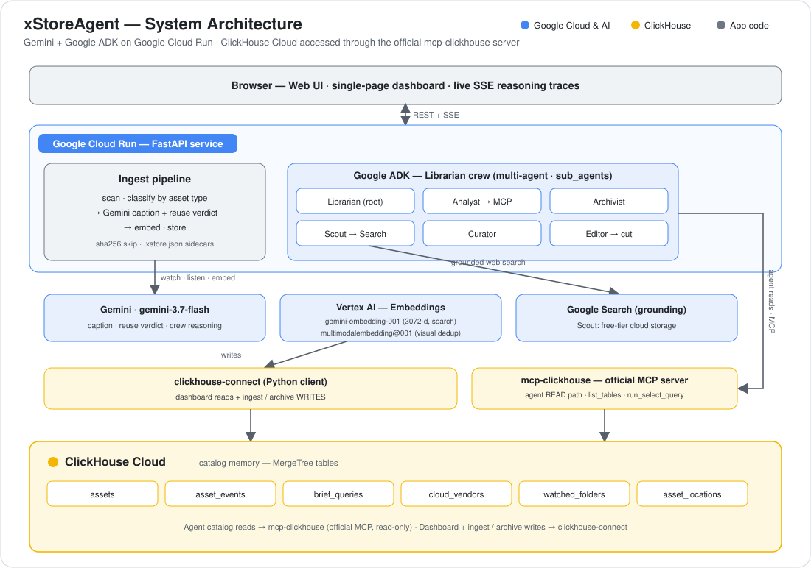

# xStoreAgent

**An AI Asset Librarian for film & video teams.** Gemini *watches* every clip and
*hears* every soundtrack; ClickHouse Cloud remembers the whole catalog. Ask in
plain English and a crew of agents tells you what you can **reuse**, how much
**duplicate storage** you're paying for, what's safe to **archive**, and even
**assembles an edit-ready cut** from footage you already own.

> Every production has a graveyard of drives. Editors hunt for hours, producers
> re-shoot and re-license shots the team already has, and the studio keeps paying
> to store the duplicates. The bottleneck isn't creativity — it's **memory**.
> xStoreAgent gives the media library a brain.

**🎬 Live demo:** https://xstoreagent-770223015971.us-central1.run.app
**▶️ 3-min video:** https://youtu.be/GIq-hI5dIJc
**❤️ Health check:** https://xstoreagent-770223015971.us-central1.run.app/api/health → `clickhouse.ok` + `mcp.ok`

*Built for the [Agentic Cinema: The Blockbuster Hackathon](https://agentic-cinema.devpost.com/) · **ClickHouse track** · Gemini + Google ADK + mcp-clickhouse on Cloud Run.*

---

## At a glance

| | |
|---|---|
| **What it is** | A multi-agent Librarian that organizes, understands, and repurposes a media library. |
| **The agent** | Google ADK root agent with 5 specialist `sub_agents` — real LLM-routed delegation on one live trace, not a single chatbot. |
| **The eyes & ears** | Gemini (`gemini-3.7-flash`) captions from the actual **pixels and audio**, not the filename, and issues a reuse verdict. |
| **The memory** | ClickHouse Cloud — every catalog **read** the agent makes goes through the **official `mcp-clickhouse` MCP server** (`list_tables`, `run_select_query`). |
| **The payoff** | Reuse instead of reshoot · reclaim duplicate GB · assemble a cut · never delete without approval. |
| **Proof it's real** | Hosted on Cloud Run, seeded at **~5,000 rows / ~1.1 TB** so every impact number is *computed*, not mocked. |

---

## What it does

Point it at a folder — or click **Ingest sample pack** on the hosted app:

1. **Segregate** every file by type — video, image, icon, vector, audio, document.
2. **Understand** it with Gemini *from the media itself*: a caption, tags, and a
   **reusable vs. project-specific** verdict (evergreen B-roll and logos float;
   slates, dialogue, and rough cuts sink).
3. **Remember** it in ClickHouse Cloud — metadata, a **caption embedding** for
   cross-modal search (`gemini-embedding-001`, 3072-d), and a separate **visual
   embedding** for near-duplicate detection (`multimodalembedding@001`).
4. **Answer in English** through a crew of agents that delegate on one trace:

   | Agent | Role |
   |-------|------|
   | 📚 **Librarian** | Root orchestrator — routes every request to a specialist |
   | 🔎 **Analyst** | Catalog SQL via the **official ClickHouse MCP server** — reuse, waste, brief search |
   | 🗄️ **Archivist** | Archives **only after you approve** — reversible, never deletes |
   | 🧭 **Scout** | Grounded Google Search for free-tier cloud storage + a computed offload plan |
   | 🎬 **Curator** | *Why* a hit belongs in the next cut |
   | ✂️ **Editor** | **Assembles an edit-ready shot list** (hook → establish → product → CTA) + honest gaps still to shoot |

5. **Never deletes on its own.** Every destructive action is human-gated.

Re-ingesting the same bytes **skips Gemini** (sha256 content hash), and `.xstore.json`
sidecars let a later ingest catalog a file from text only — so the library gets
smarter without paying to re-watch footage.

---

## Why this should win — the four axes

The hackathon judges **Idea · Tech · Design · Impact**, equally weighted. Here's
where each one lands, and where to see it live.

### 💡 Idea — a library with a brain, not another chatbot
Filenames lie; folders rot. The real bottleneck in post-production is *memory*.
xStoreAgent reframes "storage" as an **agentic reuse problem**: the same footage,
found in seconds instead of reshot for hundreds of dollars.

### 🛠️ Tech — a genuine agent loop, on the required partner
- **Real multi-agent ADK.** The Librarian delegates via `sub_agents` (LLM-routed
  transfer), *not* agent-as-tool — so a specialist's MCP calls stay visible on the
  **same event stream** the UI streams to your browser. Delegation chips are honest.
- **ClickHouse track eligibility on screen.** Every agent catalog read fires the
  **official `mcp-clickhouse` server** — `list_tables`, then `run_select_query`
  with `GROUP BY content_hash` (duplicate waste) and `cosineDistance` (brief search).
  Not a Python wrapper. Not a dashboard screenshot. `/api/health` proves `mcp.ok`.
- **Gemini that actually watches.** Video/audio **bytes** go to Gemini inline;
  captions describe on-screen motion, not the filename.
- **One embedding space for search.** Captions and briefs share a text vector
  space, so a single sentence retrieves video, stills, audio, *and* logos. Visual
  embeddings are reserved for near-dup detection — sidestepping the modality gap.

### 🎨 Design — a complete product, with the reasoning made visible
Not a notebook. A single-page dashboard: live ingest crew trace, Librarian chat
with delegation + MCP tool chips, reusability-ranked library, cross-modal search
with streaming Analyst/Curator reasoning, an **Assemble a cut** storyboard, a
reclaim list, and the Storage Scout meter. Every agentic path streams its
reasoning over **SSE** so a judge can *watch the agent think*.

### 📈 Impact — computed at production scale
The hosted demo is seeded at **~5,000 rows (~1.1 TB, ~10% duplicates)** so the
numbers are real: reclaimable gigabytes from a `GROUP BY content_hash`, a reuse
slate that avoids reshoots (heuristically hundreds of dollars each), and an
offload plan quantifying what a free storage tier would clear. Archive is
one approving click; nothing is ever auto-deleted.

---

## Architecture

<p align="center">
  
</p>

**Google products used:** Gemini (`gemini-3.7-flash`) · Google ADK (multi-agent `sub_agents`) · Vertex AI embeddings (`gemini-embedding-001`, `multimodalembedding@001`) · Google Search grounding · Google Cloud Run.
**ClickHouse products used:** ClickHouse Cloud · the official `mcp-clickhouse` MCP server (agent read path) · `clickhouse-connect` (dashboard reads + writes).

<details>
<summary>Text version of the diagram</summary>

```
Web UI (single-page dashboard, SSE live traces)
  ├─ Dashboard REST (library · search · review · assemble · storage)  → clickhouse-connect
  └─ Librarian chat (SSE)                                             → Google ADK crew
        Librarian (root orchestrator)
          ├─ Analyst   → embed_brief + official mcp-clickhouse
          │                list_databases · list_tables · run_select_query   (READ path)
          ├─ Archivist → archive_asset (only after human approval)
          ├─ Scout     → google_search (grounded) + computed offload plan
          ├─ Curator   → reuse rationale
          └─ Editor    → assemble_sequence (storyboard + gaps)
                     │
              ClickHouse Cloud
                assets · asset_events · brief_queries
                cloud_vendors · watched_folders · asset_locations
```

</details>

**The read/write split is intentional and documented.** The official
`mcp-clickhouse` server is read-only, so *agent catalog reads* go through MCP (the
track's eligibility requirement, visible on the live trace) while *dashboard grids
and ingest/archive writes* use `clickhouse-connect`. The Analyst has **no**
catalog-read tool except MCP — it can't cheat by reading in Python.

---

## Setup

**Needs:** Python 3.11+, a Google Cloud project with Vertex AI enabled, and a
ClickHouse Cloud instance.

```bash
cp .env.example .env      # GCP project + ClickHouse credentials
pip install -r requirements.txt

python scripts/fetch_demo_pack.py     # short 720p Mixkit/Pexels clips + stills
uvicorn server.app:app --reload
```

`ensure_schema()` provisions the tables on boot (or run [`agent/schema.sql`](agent/schema.sql)).
Leave `USE_CLICKHOUSE_MCP=true` and `USE_MULTI_AGENT=true`. Open the UI, click
**Ingest sample pack**, then ask the Librarian a question — `/api/health` should
report both `mcp.ok` and `clickhouse.ok`.

Optional: set `PEXELS_API_KEY` to source the sample pack from Pexels instead of Mixkit.

### Cloud Run

```bash
bash scripts/deploy.sh
python scripts/reset_library.py --yes --ingest sample_assets --project demo --seed 5000
```

The `--seed 5000` fills analytics (roll-ups, duplicate waste) at thousands of rows
so impact numbers are computed at scale. Full walkthrough in [`DEPLOY.md`](DEPLOY.md).

---

## Repo map

| Path | Purpose |
|------|---------|
| `agent/librarian.py` | ADK crew: Librarian + Analyst / Archivist / Scout / Curator / Editor |
| `agent/clickhouse_mcp.py` | Official `mcp-clickhouse` toolset (the partner integration, read path) |
| `agent/clickhouse_client.py` | Dashboard reads + ingest/archive writes (`clickhouse-connect`) |
| `agent/schema.sql` | Catalog schema (assets · events · briefs · cloud · locations) |
| `agent/tools/classify.py` | Gemini caption + reusability verdict from media bytes |
| `agent/tools/embed.py` | Caption + visual embeddings |
| `agent/tools/ingest.py` | Ingest pipeline + streaming reasoning generator |
| `agent/tools/assemble.py` | Editor shot-list / storyboard |
| `agent/tools/scout.py` | Storage Scout: grounded web search + offload plan |
| `agent/tools/cloud.py` | Sync-folder connect, organize, offload |
| `server/app.py` | FastAPI: REST + SSE endpoints |
| `web/` | Single-page dashboard |
| `scripts/deploy.sh` | One-command Cloud Run deploy |
| `scripts/seed_scale.py` | Bulk analytics rows for production-scale impact numbers |

---

## License

[MIT](LICENSE) — see the file at the repo root.
